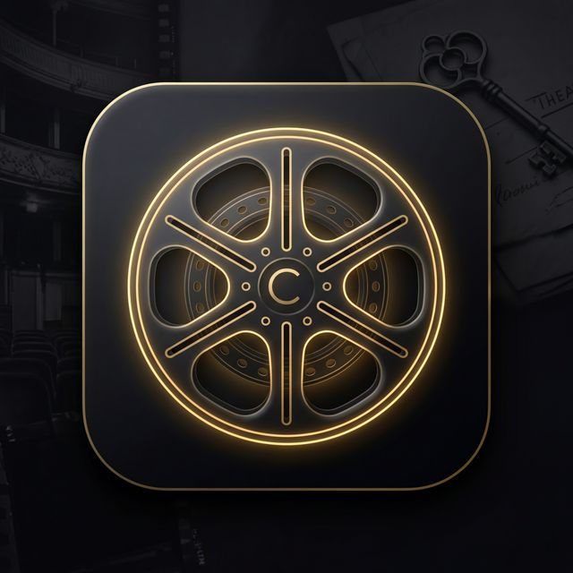

# CineLog

CineLog is a premium, high-end movie diary and library application for Android, designed with a sleek "Noir Archive" aesthetic. Keep track of your movie-watching journey, build a personal library, and log your thoughts in style.



## Features

- **Regal "Noir Archive" UI/UX**: Built entirely with Jetpack Compose, featuring advanced glassmorphism, luminous gold glowing borders, deep dark backgrounds, and rich cinematic typography (Playfair Display & Inter).
- **Library Tracker**: Search for any movie using the TMDB API, view details, and add it to your personal vault.
- **Movie Diary**: Log your watch history with star ratings, personalized notes, and interactive atmosphere tags (e.g., Intense, Visceral, Masterpiece).
- **Stats & Profile**: View dynamic statistics about your watching habits, total runtime logged, and unlock premium badges for your activity.
- **Cinematic Details**: Tap any movie to see full details, genre tags, overviews, and hero-image posters.
- **Offline Reliability**: Powered by a robust Room Database architecture allowing seamless local storage and retrieval.

## Architecture & Tech Stack

- **100% Kotlin**
- **UI Framework**: Jetpack Compose (Material 3)
- **Architecture**: MVVM (Model-View-ViewModel)
- **Local Database**: Room for robust persistence 
- **Networking**: Retrofit2 + OkHttp + ViewModel scoped Coroutines for TMDB API integration
- **Image Loading**: Coil seamlessly integrated with Compose
- **Navigation**: Jetpack Navigation Component
- **Aesthetics**: Custom glassmorphism modifiers (`glassCard`, `glassSurface`), bounce-click animations, and regal animated shimmer effects.

## Building

To build the APK locally, you need a [TMDB API Key](https://developer.themoviedb.org/docs).
Add it to your `local.properties`:

```properties
TMDB_API_KEY="your_api_key_here"
```

Then build the project:

```bash
./gradlew assembleDebug
```

## Theme Philosophy
The UI rejects flat, generic dark modes in favor of an editorial, layered experience. It uses deep rich grey (`#100F0D`) contrasted against bright regal gold (`#D4AF37`) and frosted glowing elements (glassmorphism) that give depth to interactive components. Typography relies heavily on the juxtaposition between elegant serif headers and highly readable sans-serif body text.
