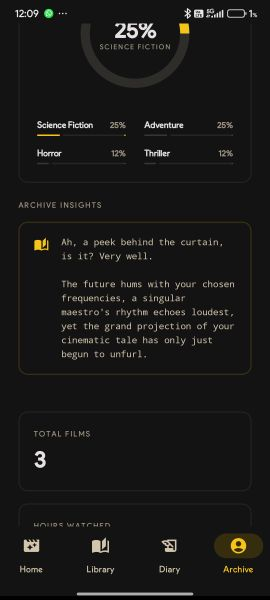
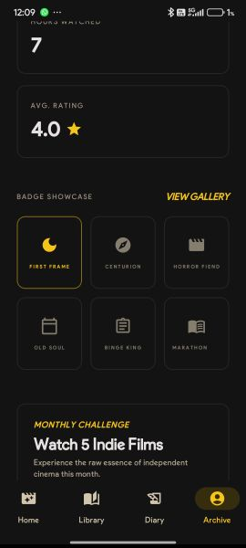
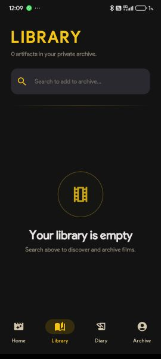

# CineLog — The Noir Archive

> *"Cinema is a mirror that can focus the shadows of the past into the light of the present."*

CineLog is a premium Android film diary for people who treat watching movies like an act of preservation. No algorithms. No social pressure. Just you, your archive, and a projector humming in the dark.


---

## Screenshots

<p align="center">
  
  
  
</p>

<details>
<summary>See the full archive →</summary>
<br>
<p align="center">
  
  
  
  
  
</p>
</details>

---

## Why I Built This

I wanted a film journal that felt like it belonged on a mahogany desk next to a reel-to-reel projector — not a growth-hacked social feed. CineLog is where I went deep on Android architecture (Hilt, Room, Compose) and asked a harder question: what does AI integration actually feel like when it knows your archive, your taste, your favorite decade, and the last ten films you loved?

The answer is the Projectionist's Booth. It's not a chatbot. It's a cinema personality.

---

## What's Inside

### 🎞 The Diary
Log films with ratings, written reviews, mood tagging, and full metadata. A month-view calendar lets you scroll back through your cinematic life the way you'd flip through a physical journal. Built on Room v5 with type converters and self-healing seed data.

### 🎬 The Library
TMDB-backed search and a personal watchlist. Find a film, read the context, decide if it earns a place in your archive. Offline-first via Room.

### 🏛 The Archive
Your cinematic identity made visible. XP progression, day streaks, a genre passport donut chart, favorite decade, and top director — all computed live from your Room data. No fake stats. Everything earned.

### 🎙 The Projectionist's Booth
An archive-aware AI guide powered by Gemini 2.5 Flash. It reads your logs, your watchlist, your genre distribution, and your favorite era before it says a word. Ask it for a mood, a double feature, a dark gorgeous thriller for tonight, or a movie that feels like midnight and neon. It will have thoughts.

Built with OkHttp directly (not Retrofit) for fine-grained control over timeouts and streaming. Context assembled from live Room queries at send time via `PromptAssembler`.

### 🏆 Milestones & Challenges
An XP engine with streak arithmetic, badge unlock logic with idempotency guarantees, and monthly challenges with eligible film filtering. Badges include First Frame, Horror Fiend, Binge King, Old Soul, Centurion, and Marathon. Fully unit tested with MockK.

---

## Architecture

Clean MVVM with strict 3-layer separation — no shortcuts, no leaking concerns between layers:

- **Data** — Room (local) + Retrofit/OkHttp (TMDB + Gemini relay)
- **Domain** — `GamificationManager`, `PromptAssembler`, `ProjectionistContext`
- **UI** — Jetpack Compose screens backed by `@HiltViewModel`

Dependency injection via Hilt. All repositories and `GamificationManager` are `@Singleton`. Coroutines throughout with structured concurrency. Unit tested with MockK + Kotlin Coroutines Test.

---

## Tech Stack

| Layer | Technology |
|---|---|
| Language | Kotlin |
| UI | Jetpack Compose, Material 3 |
| Architecture | MVVM + Repository pattern |
| DI | Hilt |
| Local DB | Room |
| Networking | Retrofit + OkHttp |
| AI | Gemini 2.5 Flash (via server relay) |
| Movie Data | TMDB API |
| Testing | MockK, Kotlin Coroutines Test |

---

## Download

### [CineLog-v2.4-WatchlistFix.apk](https://github.com/krypton-arch/Cine-Log/blob/main/releases/CineLog-v2.4-WatchlistFix.apk)

1. Download to your Android device (7.0+, API 24).
2. Allow installs from unknown sources if prompted.
3. The Projectionist's Booth runs on the hosted Gemini relay, so no API key is needed on your device.
4. This release fixes a library bug where newly added watchlist titles could fail to appear in the Library screen.
5. The APK is signed with the Android debug keystore, not a production release key.
6. Your entire archive lives on-device. Back it up before switching phones.

---

## Build From Source

### Prerequisites
- Android Studio Ladybug or newer
- A TMDB API key
- A deployed Gemini relay URL

### Setup

Add to `local.properties`:

```properties
TMDB_API_KEY=your_tmdb_key_here
GEMINI_PROXY_BASE_URL=https://your-relay.example.com
```

```bash
./gradlew assembleDebug
```

### Deploy the Relay

[](https://render.com/deploy?repo=https://github.com/krypton-arch/Cine-Log)

The included `render.yaml` provisions the `gemini-relay` service and prompts for `GEMINI_API_KEY` as a secret on first deploy. Auto-deploys are off by default — intentional.

---

## Design Language

Deep black surfaces. Warm IMDb gold (`#F5C518`) and silver smoke accents. Playfair Display for dramatic headings, Inter for readable data. Glass-card treatments, asymmetric bubble corners, tactile bounce-click interactions, and loading states that sound like a projectionist threading the next reel.

Every screen is meant to feel like a cinema that exists only for you.

<details>
<summary>Contributor Notes</summary>
<br>

- Preserve the noir tone and gold-accented visual language.
- Prefer the established typography system over ad hoc font choices.
- Avoid generic dark UI patterns when extending screens.
- If a screen doesn't feel like it belongs in a private cinema, it doesn't belong in CineLog.

</details>

---

*CineLog — An archive for those who truly see.*
